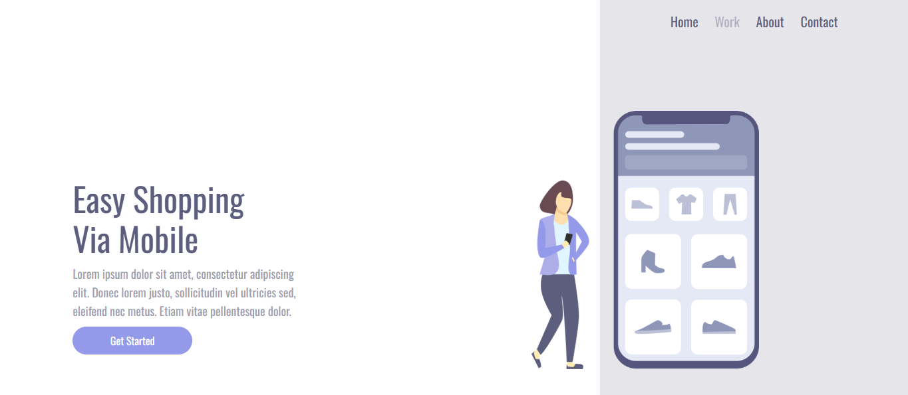

# We Care 🛍️

Projeto de site responsivo com foco em compras via dispositivos móveis.

**"We Care"** é o meu primeiro projeto com foco em **responsividade** utilizando a abordagem **mobile-first**. Desenvolvido com **HTML** e **CSS puro**, este projeto representa o início da minha jornada em desenvolvimento web e design adaptativo.

## 📱 Preview



## 💡 Funcionalidades

- Layout 100% responsivo
- Design baseado em mobile-first
- Navegação simples com links no topo
- Ilustração moderna e visual amigável
- Seção de chamada para ação com botão destacado

## 🛠️ Tecnologias Utilizadas

- HTML5
- CSS3 (Flexbox, Media Queries)

## 📂 Como visualizar o projeto localmente

Você pode abrir o projeto no seu navegador seguindo esses passos:

1. **Clone o repositório** do GitHub (quando estiver disponível):
```bash
git clone https://github.com/seuusuario/we-care.git
```

2. **Acesse a pasta do projeto**:
```bash
cd we-care
```

3. **Abra o arquivo `index.html`** no navegador:
- Se estiver usando o VS Code, clique com o botão direito em `index.html` e selecione "Open with Live Server".
- Ou, simplesmente, **dê dois cliques no arquivo `index.html`** para abrir no navegador padrão do seu sistema.

## 📚 O que aprendi

- Princípios de design responsivo com mobile-first
- Utilização de Flexbox para alinhamento de elementos
- Media queries para adaptação de layouts
- Organização básica de estrutura HTML/CSS

## 📄 Licença

Este projeto está sob a licença MIT.  
Sinta-se à vontade para usar como referência ou ponto de partida.
